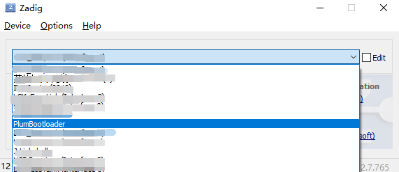
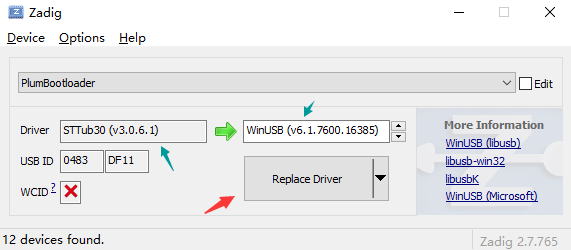

# PLUM_BOOTLOADER
This is a lightweight microcontroller bootloader. At present, you can use u2f, dfu-util.exe tools, to complete the firmware upgrade. At the same time, it is also portable and can be easily transplanted to other chips. It only needs to implement the interface under the port folder. At present, I have finished the transplantation of ch58x series, stm32f401, stm32f103, stm32l433.

This PlumUSB is written when learning CherryUSB. You can replace it with CherryUSB. I'll change to CherryUSB later.

Ch58x You need to decide whether to jump to the app.
```
bool lgk_boot_app_is_vaild(uint32_t check_code_add)
{
    /*!< Your code >*/
    return true;
}
```

# Build
## uf2
```
cd examples/xxx
make or make BL_TYPE=uf2
```

## dfu
```
cd examples/xxx
make BL_TYPE=dfu
```

# Make APP file
```
ch58x:
#define BOARD_FLASH_APP_START 0x00010000UL

stm32f103:
#define BOARD_FLASH_APP_START 0x08005000UL

stm32f401:
#define BOARD_FLASH_APP_START 0x08010000UL

stm32l433:
#define BOARD_FLASH_APP_START 0x08010000UL
```
You need to set the starting address of your firmware to BOARD_FLASH_APP_START. You can modify the link file in your own project file to achieve this purpose.
When you have the xxx. hex file, you only need to go to the official side of UF2 to get the uf2conv.py and uf2Families.json files.
## uf2
```
ch58x:
#define BOARD_UF2_FAMILY_ID  0xabcdc582 // BOARD_UF2_FAMILY_ID is defined in uf2.h

stm32f103:
#define BOARD_UF2_FAMILY_ID  0xabcdf103 // BOARD_UF2_FAMILY_ID is defined in uf2.h

stm32f401:
#define BOARD_UF2_FAMILY_ID  0xabcdf401 // BOARD_UF2_FAMILY_ID is defined in uf2.h

stm32l433:
#define BOARD_UF2_FAMILY_ID  0xabcd1433 // BOARD_UF2_FAMILY_ID is defined in uf2.h

Then you can run:
hex:
python uf2conv.py xxx.hex -o xxx.uf2 -c -f BOARD_UF2_FAMILY_ID

bin:
python uf2conv.py xxx.bin -o xxx.uf2 -c -f BOARD_UF2_FAMILY_ID -b BOARD_FLASH_APP_START
```
The you can drag the .uf2 file into the u disk to download.

## dfu
DfuSeDemo is the official dfu burning software of ST, but it needs to make bin files into dfu files before it can be used. When you install DfuSeDemo, the production software of bin to dfu will be automatically installed. You can choose this method, but I do not recommend it.

Another way to use dfu on windows is through dfu-util.exe. Other platforms need to be explored on your own. Here we use ch58x as an example. The windows steps are as follows:

### Step1
Run zadig-2.7.exe under the utils folder and make sure your device is in dfu mode.
Click Options and List All Devices, as shown in the figure below. You can see the device PlumBootloader, and select it,



and click Replace Driver to replace the driver with winusb,



### Step2
Now you can open the terminal under the utils folder and input ./CH58x_dfu_util.sh
if successfull,you will see:
```
./CH58x_dfu_util.sh
dfu-util 0.11

Copyright 2005-2009 Weston Schmidt, Harald Welte and OpenMoko Inc.
Copyright 2010-2021 Tormod Volden and Stefan Schmidt
This program is Free Software and has ABSOLUTELY NO WARRANTY
Please report bugs to http://sourceforge.net/p/dfu-util/tickets/

Found DFU: [0483:df11] ver=2200, devnum=36, cfg=1, intf=0, path="1-2", alt=0, name="@Internal Flash   /0x00000000/16*004Ka,096*04Kg", serial="2022123456"
dfu-util 0.11

Copyright 2005-2009 Weston Schmidt, Harald Welte and OpenMoko Inc.
Copyright 2010-2021 Tormod Volden and Stefan Schmidt
This program is Free Software and has ABSOLUTELY NO WARRANTY
Please report bugs to http://sourceforge.net/p/dfu-util/tickets/

Warning: Invalid DFU suffix signature
A valid DFU suffix will be required in a future dfu-util release
Opening DFU capable USB device...
Device ID 0483:df11
Device DFU version 011a
Claiming USB DFU Interface...
Setting Alternate Interface #0 ...
Determining device status...
DFU state(2) = dfuIDLE, status(0) = No error condition is present
DFU mode device DFU version 011a
Device returned transfer size 4096
DfuSe interface name: "Internal Flash   "
Downloading element to address = 0x00010000, size = 27360
Erase           [=========================] 100%        27360 bytes
Erase    done.
Download        [=========================] 100%        27360 bytes
Download done.
File downloaded successfully
Submitting leave request...
Error during download get_status
```
The bin file of this test will make your settings into a daplink.

# The app interacts with the boot
Your app should have the following code
```
ch58x:
void boot_jump(void)
{
    uint32_t *boot_magic = (uint32_t *)0x20007ffc;
    *boot_magic = 0xc220b134;
    mcu_reset();
}

stm32f103:
void boot_jump(void)
{
    uint32_t *boot_magic = (uint32_t *)0x20004c00;
    *boot_magic = 0xc220b134;
    mcu_reset();
}

stm32f401:
void boot_jump(void)
{
    uint32_t *boot_magic = (uint32_t *)0x2000fc00;
    *boot_magic = 0xc220b134;
    mcu_reset();
}

stm32l433:
void boot_jump(void)
{
    uint32_t *boot_magic = (uint32_t *)0x2000fc00;
    *boot_magic = 0xc220b134;
    mcu_reset();
}
```